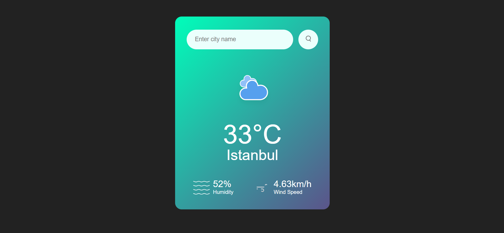

# Weather App

Bu proje HTML,CSS ve JS kullanarak geliştirdiğim bir Hava Durumu uygulamasıdır.
Bu projeyi oluştururken bu linkteki kaynaktan yararlandım: https://youtu.be/MIYQR-Ybrn4

## Kurulum

İlk olarak aşağıdaki komutu kopyalayınız.
Ardından terminal ekranını açarak, projenin kurulmasını istediğiniz bir alana gelip yapıştırarak çalıştırabilirsiniz.

```javascript
git clone https://github.com/aligencay/weather-app.git
```

## Çalıştırma

- https://weather-app-aligencay.vercel.app

Linkini kullanarak projemi daha detaylı inceleyebilirsiniz.

## Genel Bakış

<div>



</div>

## Daha fazlası

Daha fazlası ve aklınıza takılan herhangi bir soru için için bana kişisel hesaplarım üzerinden ulaşabilir, "Pull Request" isteklerinde bulunabilirsiniz.
